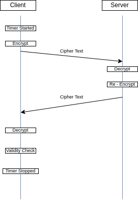

=============
Lightweight Encryption
=============
The goal of this project is to measure the performance of `Ascon`_ through different
measurements and a comparision to AES.

Performance Metrics
-------------------

* Processor usage
* Time
* Power Consumption

Since the precision and difficulty of synchronizing clocks is outside the scope
of this project, round trip time is being measured and divided in half. The
plaintext message is randomly generated beforehand.

The process is as follows:

1. Clock is started
2. Plaintext is encrypted to ciphertext
3. Ciphertext is send to server
4. Server unencrypts ciphertext to plaintext
5. Plaintext is re-encrypted
6. Re-encrypted ciphertext send back to client
7. Client unencrypts to plaintext
8. Plaintext then compared to original message
9. Clock is stopped

*Diagram shown below*

Pcap
----

1. The captured Pcap file is included under /Test Data/
2. Decryption keys are not included for security purposes
3. Please contact `Andrew`_ for specifics regarding Pcap

.. _Ascon: https://github.com/meichlseder/pyascon/
.. _Andrew: https://github.com/0r4n63Ju1c3

Results
--------

* Collected Data 
* Security test 
* Implementation on IoT Team

see final `presentation` for more information 
https://docs.google.com/presentation/d/18Ub8kXIM2R3_FJEu63kFrnCrs4ibdrbBCSs5puOJLVc/edit#slide=id.g12222d6693f_0_13

Challenges
----------

1. Working with the IoT team
- Scheduling conflicts between when teams were available to work on the source code.
- Deletion of code or refactoring requirements.

3. Wireless network congestion inside of USAFA made it difficult
to get packet capture.

2. Weather station was outdoors during inclement weather and had
ittermitent power issues that required the system to be brought
back indoors. Testing remained indoors for the remainder of
our measurements.

Future
-------
A hardware implementation is the next step for this project. This could be accomplished through the use of an FPGA utilizing already written code found online.Current FPGA's are on back order or out of stock and fell outside of the given timeline. Get a FGPA with *System on Chip* (SOC). This makes it easier so that you dont have to write a driver to manage communication between the Pi and FPGA. For this to work, you also need to have a VHDL or Verilog files. Both of these files should be easily found online. 

The other future of the project is to continue to encrypt the IoT systems and create a key exchange system.
